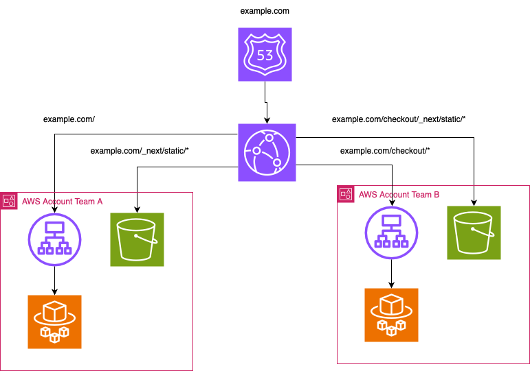

# Vertical micro frontends with Next.js

In a previous post, I was talking about the challenge of distributed development in the frontend ecosystem, especially in large companies with multiple engineering teams. In this post, I’ll share how we can create different Next.js applications and how we can route traffic to them in AWS.

Let's say we have a web application with 3 steps: a landing page, a search page, and a checkout page, each of them owned by a different engineering team (team A, B, C). Instead of creating a single Next.js app, each team can have its own Next.js with a different base path.

## Building and hosting each Next.js app

There is plenty of discussion about whether self-hosting Next.js is easy or not (see [this article](https://www.epicweb.dev/why-i-wont-use-nextjs) for example). IMO, self-hosting a Next.js application using Docker containers is not more difficult than any other web service. However, when it comes to deploying it in a serverless way using something like AWS Lambda, then it is not as easy. That is why there are frameworks like OpenNext that build your application and create different adapters for AWS (or Docker too).

When you build multiple different applications, there are some cross-cutting concerns that you probably want to address that need to be solved in all of them, things like:

- **Auth** (e.g., decode a cookie token and validate with your Auth service/provider)
- **Security** (e.g., validate CSRF tokens)
- **Cookies** (e.g., generating visit/guest IDs)
- **Headers** (e.g., injecting correlation/trace IDs)
- **Default Monitoring** (e.g., integrate log agents like DataDog)
- **Auditing** (e.g., put all your requests in your data warehouse)

How can we solve this? Should we create some npm libraries and just tell the teams to put them in their request middlewares? While this could work, it is difficult to ensure that each team integrates all those utilities properly or does not accidentally remove some.

Besides, current NextJS [middleware does not allow the use of Node.js runtime APIs](https://github.com/vercel/next.js/discussions/46722) since it is meant to be executed in Vercel Edge, and maybe some library you use is using some Node.js API.

So, how can we ensure all teams handle all topics mentioned above without having them include all the libraries and modify their codebase? Ideally, we want those features already solved for each team without them even being aware of it.

## OpenNext

As I said before, [OpenNext](https://open-next.js.org/) is an open-source framework that allows you to create your own version of your Next.js request handler. By default, it contains wrappers to deploy it to AWS Lambda, but version 3 allows you to define your own wrapper of the Next.js request handler, which is very useful in case you want to customize each Next.js app you build with all the features mentioned above.

Here’s an example of how to add your custom request handler. This code snippet shows the configuration for OpenNext:

```javascript
/** @type {import('open-next/types/open-next').OpenNextConfig} */
const openNextConfig = {
  default: {
    override: {
      wrapper: "node",
      converter: () =>
        import("./overrides/converter").then((mod) => mod.default),
    },
  },
};

export default openNextConfig;
```

And our custom converter where we can access the request object and inject headers:


```javascript
import { IncomingMessage, ServerResponse } from "http";
import converter from "open-next/converters/node.js";
import { InternalResult } from "open-next/types/open-NextJS";

const CustomNodeConverter = {
  convertFrom: async (event: IncomingMessage, other: any) => {
    const result: any = await converter.convertFrom(event);

    return {
      ...result,
      headers: {
        ...result.headers,
        "x-inserted-in-converter": "1",
      },
    };
  },
  convertTo: async (intResult: InternalResult) => {
    const result = await converter.convertTo(intResult);
    return {
      ...result,
      headers: {
        ...result.headers,
        "x-converter-end": "1",
      },
    };
  },
  name: "custom-node-converter",
};

export default CustomNodeConverter;
```

This code modifies the request object and the response for each request that reaches your application (the example injects headers).

With this capability, the only thing you need to do is build each app with the same configuration. So, how can we create all our apps with that configuration?

We can create a CLI utility that builds the Next.js app using the same config. So instead of running the default npm task,
we could create our custom one that relies on our custom OpenNext build.

```javascript
build: "custom-nextjs-build"
```

Each team building their Next.js app with that CLI will have all those features by default without modifying anything in their repo/codebase (of course, you will need to ensure all apps are built using that command, but that can be enforced easily, for example, in the CI/CD pipelines).


[Here is an example of how the CLI could look like](https://github.com/manxeguin/open-next-v3-demo/tree/main/packages/custom-server)

Then we will use Docker to containerize the solution and upload our Docker image to our image registry (ECR).

In this example, we are going to use AWS Fargate to deploy the Docker image. If you are using IaC and AWS CDK, there is already a construct to do this ([ApplicationLoadBalancedFargateService](https://docs.aws.amazon.com/cdk/api/v2/docs/aws-cdk-lib.aws_ecs_patterns.ApplicationLoadBalancedFargateService.html)).

For the static assets of the Next.js app, we can deploy them to an S3 bucket.

## Routing the traffic to each Next.js application

Now that we’ve discussed building and hosting our Next.js applications, let’s explore how to effectively route traffic to each application using AWS CloudFront. This step is crucial for ensuring that users are directed to the correct application based on their requests. By assigning a different base path to each app, we can use a CloudFront distribution to redirect traffic to the appropriate origins. The same way we could redirect traffic using a reverse proxy based on the request path, CloudFront allows us to do the same using different CloudFront behaviors. Basically, a CloudFront behavior will allow you to tell the distribution, “Hey, all the traffic that comes with this base path, send it to this origin.”

Here is a simplified version of how the infrastructure as code (TypeScript CDK) would look like:
```javascript
const distribution = new cloudfront.Distribution(this, 'MyDistribution', {
      defaultBehavior: {
        origin: albDefaultOrigin,
        viewerProtocolPolicy: cloudfront.ViewerProtocolPolicy.REDIRECT_TO_HTTPS,
      },
      additionalBehaviors: {
        // Behavior for the first web application
       '/*': {
          origin: albDefaultOrigin,
          …,
        },
        // Behavior for the second web application
        '/checkout/*': {
          origin: checkoutALBOrigin,
          …
        },
      },
    });
```
The architecture should look something like this:



**Note:** *This is a simplified version of how the architecture could be, we are not covering networking (VPCs, how to restrict ingress/egress traffic, etc.), security (WAF), identity access with IAM roles/policies or how to deploy the static assets to each S3 bucket or the CI/CD process. These aspects can vary significantly depending on your needs and are outside the scope of this post*

## Other cloud providers
In the example I’ve shared how we can deploy the apps to AWS, but since it is a containerized solution, the same pattern can be applied to any other cloud provider or on-premise solution. We are not using any vendor lock solution here. For example, we could have solved the Auth part using an AWS API Gateway + Lambda Authorizer, or even a CloudFront Lambda@Edge, but we are solving the common features at code layer not infra layer. Deploying this in GCP using Google Cloud Run + a reverse proxy should not be much different from this (or even a Raspberry Pi!).

That is why I like the solution using the OpenNext wrapper; it allows us to solve cross-cutting concerns at the application layer while keeping teams unaware without having to care about it.

## Wrap up
Using OpenNext to manage vertical micro frontends with Next.js in AWS allows teams to focus on their specific applications while ensuring that essential cross-cutting concerns are addressed. By implementing a CLI utility and containerizing the solution, we can streamline the development process and enhance collaboration among engineering teams. As you explore this approach, consider how it can be adapted to your own projects and the unique challenges you face.

[Here is a repo](https://github.com/manxeguin/open-next-v3-demo/) that implements a Next.js app with an injected header using OpenNext


