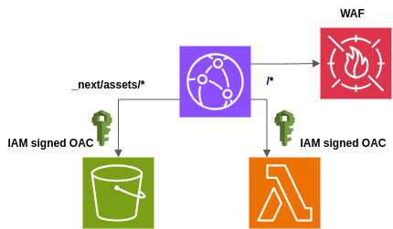

title: Self-host Next.js on AWS in a serverless way
date: 2025/4/28
description: A demo of how to deploy Next.js apps on AWS using CDK and serverless infrastructure.
author:
---

# Serverless Next.js on AWS with CDK

## Intro

In a [previous article](https://manxeguin.github.io/posts/nextjs-vertical-microfrontends), I talked about how to route traffic to different Next.js apps in a vertical micro frontend architecture. That article focused mostly on routing and how to structure things at a high level. This post goes deeper into the infrastructure side, showing how we can run those apps in a serverless way using AWS CDK.

Many people say Next.js isn’t easy to deploy in non-Vercel environments. For example, [Kent C. Dodds wrote](https://www.epicweb.dev/why-i-wont-use-nextjs) about why he doesn’t want to use Next.js, and one of the reasons was the complexity of deploying it. And yes, it’s not always straightforward; but it _can_ be done. More importantly, it can be done **well**, using serverless infrastructure on AWS. In this post, I’ll show you how.

## Architecture

The architecture we’ll use is simple, serverless, and uses mostly managed services:

- **Next.js app built with OpenNext**
- **Static assets stored in S3**
- **Server function deployed as a Lambda Function URL**
- **CloudFront distribution** in front of everything
- **IAM policies** to make Lambda and S3 private
- Optional: **WAF** for security at the edge (not included in code, but easy to add)
- All managed with **AWS CDK** (in TypeScript)

Here’s a diagram to help visualize it.



## Next.js as Lambda

To deploy Next.js in a serverless way, we use [OpenNext](https://open-next.js.org/), an open-source tool that builds your app in a format ready to be deployed on AWS.

After running `open-next build`, the output contains a `.open-next/` folder with everything split into:

- `assets/` → static files (like images, JS, CSS)
- `server-functions/` → Lambda handler code
- `open-next.output.json` → a JSON config that defines how to route requests

We upload the assets to an S3 bucket, and zip the `server-function.zip` to deploy it as a Lambda function. This function becomes the "brain" of the app; it handles requests and renders HTML.

One cool thing here is that we enable **streaming responses** by using `InvokeMode.RESPONSE_STREAM` on the Lambda.

```typescript
serverFunction.addFunctionUrl({
  authType: FunctionUrlAuthType.AWS_IAM,
  invokeMode: InvokeMode.RESPONSE_STREAM,
});
```

We also need to tell OpenNext to build using streaming mode by passing the `aws-lambda-streaming` wrapper option. With that setting the Lambda handler code will be built using `awslambda.streamifyResponse`, [see this AWS post about it](https://aws.amazon.com/blogs/compute/introducing-aws-lambda-response-streaming/).

This allows us to use features like React Server Components and send chunks of the HTML while rendering. If you're curious about why this matters for performance, I wrote more about it [here](https://manxeguin.github.io/posts/web-performance-streaming).

Now, a small warning: OpenNext is a solid project, but by using it, we are adding a new dependency that sits between us and the Next.js team. If Next.js releases a new version, we need to wait for OpenNext to support it before we can upgrade. It’s not a blocker, but it’s something to keep in mind.

## CloudFront as ingress point

Once we have our Lambda function and static assets ready, we put CloudFront in front of everything. CloudFront becomes the **only public entry point** of our app.

The `open-next.output.json` file defines behaviors like:

- Which path goes to Lambda (SSR)
- Which goes to S3 (static assets)
- Which goes to the Image Optimization Lambda (Not used in this example)

We apply all that config to CloudFront using CDK so every route behaves as it should.

Now let's talk about **security**.

We don’t make S3 or Lambda URLs public. Instead, we create **Origin Access Controls (OAC)** and IAM policies that say: “Only CloudFront can access these.”

```typescript

private createOriginAccessControl(
    name: string,
    type: "s3" | "lambda"
  ): CfnOriginAccessControl {
    return new CfnOriginAccessControl(this, name, {
      originAccessControlConfig: {
        name,
        description: `OAC for ${type.toUpperCase()}`,
        originAccessControlOriginType: type,
        signingBehavior: "always",
        signingProtocol: "sigv4",
      },
    });
  }

lambdaFn.addPermission("AllowCloudFrontInvoke", {
      principal: new ServicePrincipal("cloudfront.amazonaws.com"),
      action: "lambda:InvokeFunctionUrl",
      functionUrlAuthType: FunctionUrlAuthType.AWS_IAM,
      sourceArn: `arn:aws:cloudfront::${Stack.of(this).account}:distribution/${distribution.ref}`,
    })

bucket.addToResourcePolicy(
      new PolicyStatement({
        actions: ["s3:GetObject"],
        resources: [bucket.arnForObjects("*")],
        principals: [new ServicePrincipal("cloudfront.amazonaws.com")],
        conditions: {
          StringEquals: {
            "AWS:SourceArn": `arn:aws:cloudfront::${Stack.of(this).account}:distribution/${distribution.ref}`,
          },
        },
      })
    );
```

That way:

- Nobody can access the Lambda function directly
- Nobody can download assets from S3 directly
- All traffic must go through CloudFront

Because CloudFront is our only ingress point, we can also attach a **Web Application Firewall (WAF)** to it. This gives us a single place to apply rate limiting, block bad IPs, or prevent common attacks. Very useful, and very clean.

## Optional

One more thing worth mentioning: using CDK makes it really easy to spin up **preview environments**. You can deploy the same stack with a different name or tag, and get a working copy of your app for each pull request. You could even go further and add **Lambda deployment groups** to do canary releases, but that’s out of scope for this simple demo.

## Wrap up

Next.js is often seen as something tightly coupled to Vercel, but it doesn’t have to be. With OpenNext and AWS CDK, we can run modern apps in a scalable and secure serverless environment.

Yes, there are some trade-offs, like adding a dependency on OpenNext, but this is a strong approach if you're already using AWS and want more control over your infra.

Even taking into account that this simple demo does not support things like **image optimization** or **incremental static revalidation**, sometimes a plain Next.js app with SSR is all you need.

[Here is the full code of the demo](https://github.com/manxeguin/open-next-v3-demo/blob/main/packages/infra/lib/nextjs-construct.ts).

If you’re curious about how to organize multiple apps with routing and micro frontends, check out my earlier post [here](https://manxeguin.github.io/posts/nextjs-vertical-microfrontends).
