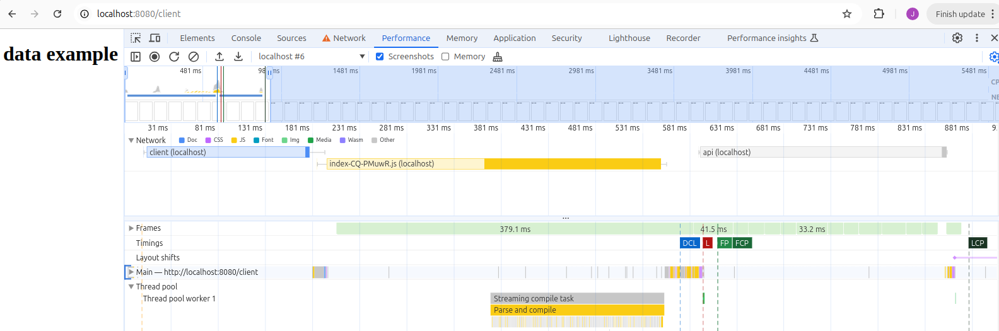
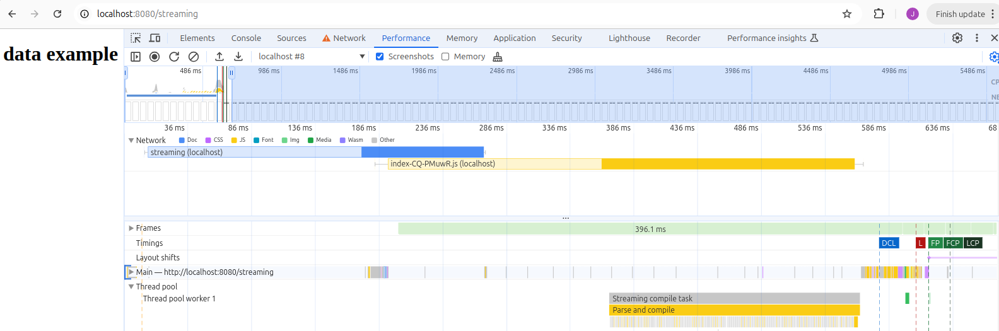

## 🚀 Why Web Performance matters

Let’s start with a quick note about performance. Websites today need to be fast, because users expect it. If your site is slow, people leave. And when people leave, they don’t buy, they don’t sign up, and they don’t come back.

Google tracks a few main metrics: **LCP** (how fast the main content shows), **INP** (how fast the site responds to interaction), and **CLS** (does stuff move around during load?).

Now, let me give you a small personal take on **LCP**. Honestly, I don’t think it’s always a good metric.

Why? Because **Google picks what it thinks is the “main” element on the screen**, and sometimes it gets it wrong. Imagine you have a web app that shows financial data, and at the top you have a big title that says **“Earning Reports”**, but the actual report with the real content takes 3 seconds to load. Google might track the title as the LCP — and tell you the page is fast — even though the part your users care about (the report) is still not there.

So yeah, LCP is helpful in many cases, but don’t blindly trust it. Always check what it’s measuring and ask yourself: _is this really what matters for my users?_

That’s where techniques like **streaming** can really help — they can let you show the real content faster, not just some heading or placeholder.

---

## 🌊 Let’s Talk About Streaming

Now, let’s talk about **streaming**. Maybe you've seen it in frameworks like **Next.js**, where you can stream parts of a React app. But actually, this idea has been around for a long time—way before React existed.

### A bit of history: Facebook’s BigPipe

Back in 2009, Facebook built a framework called **BigPipe**. It was a system to split a page into smaller chunks ("pagelets") and send them to the browser as soon as they were ready. So instead of waiting for the whole page to be built, users could see parts of it appear earlier.

BigPipe helped Facebook load complex pages faster, especially with dynamic content like the news feed. You can think of it as an early version of what many modern frameworks do today.

### Another real-world example: Instagram

Streaming is still super relevant. In [this Instagram engineering blog post](https://instagram-engineering.com/making-instagram-com-faster-part-2-f350c8fba0d4), the team explains how they send the `<head>` of the document and styles early while they are generating the API data and streaming it using HTML `<script>` tags.

They didn’t use fancy frameworks for that, the solution was implemented on top of `StreamingHttpResponse` from Django (Python). It shows how powerful this approach can be, showing a **23% latency improvement**.

### Modern take: Next.js and React Server Components

Next.js takes streaming to the next level abstracting the complexities using **React Server Components (RSC)**. Instead of sending all the HTML at once, it appends serialized chunks of the component (RSC) in form of `<script>` tags.

Here’s an example of one of those streamed chunks (simplified and with random data):

```html
<script>
  self.__next_f.push([
    1,
    '13:{"metadata":[["$","title","0",{"children":"Acme Dashboard"}],["$","meta","1",{"name":"description","content":"Real-time metrics and insights for your business."}],["$","link","2",{"rel":"canonical","href":"https://acme.io/dashboard"}],["$","meta","3",{"property":"og:title","content":"Acme Dashboard"}],["$","meta","4",{"property":"og:description","content":"Track your KPIs with Acme."}],["$","meta","5",{"property":"og:image","content":"https://acme.io/images/og.png"}],["$","meta","6",{"name":"twitter:card","content":"summary_large_image"}],["$","meta","7",{"name":"twitter:title","content":"Acme Dashboard"}],["$","meta","8",{"name":"twitter:description","content":"Real-time business insights at your fingertips."}]],"error":null,"digest":"$undefined"}\nd:{"metadata":"$13:metadata","error":null,"digest":"$undefined"}\n',
  ]);
</script>
```

Each chunk represents the result of the rendered RSC.

---

## ☕ Streaming in Java

Let’s create a simple example using Java with the Quarkus framework.

(Note: I’m not a Java expert — I just picked it because I’ve used it in a previous job and it’s still widely used in many companies.)

Just like in the Instagram example, we want to start sending the HTML early while we work on some server data. To do that, we can stream the response in two parts:

1. The first chunk includes the `<head>` and a small inline `<script>` that sets up a client-side cache.
2. The second chunk sends the data (inlined in a script tag) and finishes the HTML.

We use a little trick to preload the `/api` data in the browser:

```html
<script>
  window.__PRELOAD_CACHE_RESOLVERS__ = {};
  window.__PRELOAD_CACHE__ = {
    "/api": new Promise((resolve, reject) => {
      window.__PRELOAD_CACHE_RESOLVERS__["/api"] = resolve;
    }),
  };
</script>
```

And here’s a basic example of how to stream two chunks using Java:

```java
public StreamingOutput getStreamingOutput() {
        return new StreamingOutput() {
            @Override
            public void write(OutputStream os) throws IOException {
                String templateContent = templateRenderer.getRenderedTemplate();
                os.write(templateContent.getBytes());
                os.flush();

                String streamingProps = templateRenderer.getStreamingProps();
                if (streamingProps != null) {
                    os.write(("<script>window.__PRELOAD_CACHE_RESOLVERS__[\"/api\"](" + streamingProps + ");</script>")
                            .getBytes());
                    os.flush();
                }
                os.write("</body></html>".getBytes());
                os.close();
            }
        };
    }

```

This is a basic but effective way to simulate streaming. The first part of the page gets rendered and the browser can already start downloading styles and scripts. Then, once the backend finishes calculating the `/api` data, we flush it through a script tag and resolve the client-side promise.

Then, our React app can use that preloaded cache:

```typescript
export const useFetch = (url: string) => {
  const [data, setData] = useState(null);
  const [loading, setLoading] = useState(true);
  const [error, setError] = useState<string | null>(null);

  useEffect(() => {
    const fetchData = async () => {
      try {
        let result;
        if (window.__PRELOAD_CACHE__[url]) {
          result = await window.__PRELOAD_CACHE__[url];
        } else {
          const response = await fetch(url);
          result = await response.json();
          if (!response.ok) {
            throw new Error("Network response was not ok");
          }
        }

        setData(result);
      } catch (error) {
        setError("error.message");
      } finally {
        setLoading(false);
      }
    };

    fetchData();
  }, [url]);

  return { data, loading, error };
};
```

[Here is a link to the full code example](https://github.com/manxeguin/quarkus-streaming-demo)

## 🔍 Comparing Normal vs Streaming in Action

Let’s see what this looks like in practice. If you open DevTools and compare a normal page load vs a streaming page, you’ll notice a clear difference in how the browser handles the work.

### 🐢 Without Streaming



In this example, everything happens one step at a time:

- The browser waits for the full HTML response
- Then it downloads and parses the JavaScript
- Only _after that_ does it make the API request

It’s all sequential — which slows things down.

### ⚡ With Streaming



With streaming, we start sending the HTML right away. That allows:

- The browser to start downloading and parsing JavaScript early
- The API request to be kicked off in parallel

So instead of waiting for one thing to finish before starting the next, we overlap work — and that saves time.

Even if the backend takes the same amount of time to generate data, users see the page **much faster**.

---

## ✅ Pros and ❌ Cons

### ✅ Pros

- Critical resources (CSS, JS, etc.) can start downloading while the backend is still working — users see content faster and get a smoother experience
- Works in any language or framework that lets you control the response stream (Java, PHP, Go, etc.)

### ❌ Cons

- The **DOMContentLoaded** event doesn’t fire until the full HTML is received — so if you use JS libraries that wait for it, they might be delayed (careful with deferred scripts)
- Some **infrastructure doesn’t support streaming well**, like **AWS API Gateway**, which buffers the full response before sending it (and others might behave the same)
- Debugging is harder — if something breaks halfway, you might not get a proper error page
- You have to manage **flushing and chunk order carefully** — this adds complexity, and it's one of the things that **frameworks like Next.js make easier**

---

## Wrap up

Streaming is not new. It’s not a fancy React-only thing. It’s been around since **HTTP 1.1**, and it's still useful today.

You can use it in Java. You can use it without frameworks. And you can use it to improve the real experience users have with your site.

Thanks for reading.
